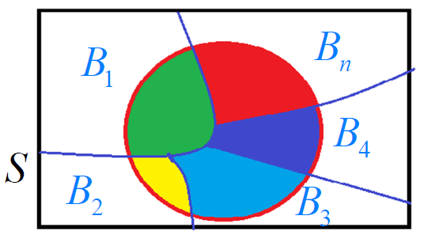

## 概率论

### 0 事件的计算


### 1 古典概率

抽扑克牌

如果试验满足：

•  样本空间S中样本点有限(**有限性**)

•  出现每一个样本点的概率相等(**等可能性**)

称这种试验为等可能概率(或古典概率)
$$
P(A)=\frac{A所包含的样本点数}{S中的样本点数}
$$

### 2 联合概率

联合概率指的是包含多个条件且**所有条件同时成立**的概率，记作P(X=a,Y=b)或P(a,b)。


### 3 条件概率

事件*B*在事件*A*发生的条件下发生的概率：
$$
P(B|A)=\frac{P(AB)}{P(A)}, \quad P(A)\not= 0
$$

$$
P(AB) = P(A) \cdot P(B | A) = P(B) \cdot P(A| B)
$$

### 4 全概率公式

设 $B_1,B_2,...,B_n$ 为 样本空间 S 的一个划分且 $P(B_i )> 0$ . 则有全概率公式：
$$
P(A)=\sum^n_{j=1}P(B_j) \cdot P(A|B_j)
$$



$$
P(A)=\sum^n_{j=1}p_jq_j
$$

### 5 贝叶斯公式

设 $B_1,B_2,...,B_n$ 为 S 的一个划分且 $P(B_i)> 0$ . 对 $P(A)>0$ 则有贝叶斯公式:


## 随机变量

### 随机变量（Random Variable）

随机变量是指变量的值无法预先确定仅以一定的可能性(概率)取值的量。它是随机获得的非确定值。

在经济活动中，随机变量是某一事件在相同的条件下可能发生也可能不发生的事件。例如某一时间内公共汽车站等车乘客人数，电话交换台在一定时间内收到的呼叫次数等等，都是随机变量的实例。

随机变量可以是离散型的，也可以是连续型的。


如果随机变量 ${\displaystyle X}$ 的取值是有限的或者是可数无穷尽的值，则称X 为离散型随机变量。


如果 ${\displaystyle X}$ 由全部实数或者由一部分区间组成，则称 ${\displaystyle X}$ 为连续随机变量。

, 

连续随机变量的取值是不可数及无穷尽的。


###离散型随机变量及其概率分布

##### 0-1分布（伯努利分布）

若X的概率分布为


其中 $0<p<1$ , 就称X服从参数为 p 的 0-1 分布（或两点分布），记为 $X \sim B(1，p)$ . 1表示1次伯努利实验，p表示X取1的概率。

对于只有两个可能结果的试验, 称为伯努利(Bernoulli) 实验，故两点分布有时也称为伯努利分布.

应用：

检查产品的质量是否合格

对新生婴儿的性别进行登记

检验种子是否发芽

考试是否通过

求婚是否成功

马路乱停车是否会受罚


##### 二项分布 (Binomial)（n重伯努利实验）

若X的概率分布为
$$
P(X=k)=C_n^kP^k(1-p)^{n-k}, k=0,1,2,...n
$$
则称X 服从参数为n, p的二项分布, 记为 X~B（n，p），其中 $0<p<1$ .

当n=1时，为伯努利分布。

二项分布描述的是n重伯努利试验中“成功”出现次数 X 的概率分布.


### 连续型随机变量及其概率密度

连续型随机变量的概率密度函数（Probability density function）是一个描述这个随机变量的输出值，在某个确定的取值点附近的可能性的函数。


图中，横轴为随机变量的取值，纵轴为概率密度函数的值，而随机变量的取值落在某个区域内的概率为概率密度函数在这个区域上的积分。

设连续型随机变量X的分布函数为F(x),  若存在一个非负的函数 f(x), 对任何实数 x , 有
$$
F(x)=\int^x_{-\infty}f(t)dt
$$
则称 f(x) 为X的概率密度函数, 简称概率密度 .


#### 均匀分布（uniform distribution）

若随机变量X的概率密度为
$$
f(x)=\left\{{\begin{matrix}{\frac  {1}{b-a}}&\ \ \ {\mbox{ }}a\leq x\leq b\\0&{\mbox{其他}}\end{matrix}}\right.
$$
其中 $a<b$ ，就称 X服从（a，b）上的均匀分布，记为  ${\displaystyle X\sim U(a,b)}$ . 


性质：均匀分布具有等可能性,  X落入(a,b)中的等长度的任意子区间上是等可能的.

#### 正态分布（normal distribution）

**正态分布**又名**高斯分布**（**Gaussian distribution**）

若X的概率密度函数为
$$
f(x)={1 \over \sigma\sqrt{2\pi} }\,e^{- {{(x-\mu )^2 \over 2\sigma^2}}}, \quad -\infty<x<+\infty
$$
其中 $-\infty <\mu<+\infty, \sigma>0$ , 就称X 服从参数为  $\mu, \sigma$ 的正态分布（高斯分布），记为

  ${\displaystyle X\sim N[\mu,\sigma^2]}$ . 其中 $\mu$ 是均值， $\sigma$ 是方差。


应用：

测量误差

人的身高

体重

医学检验指标(红细胞数、血小板)


## 贝叶斯理论

贝叶斯理论源于贝叶斯提出的贝叶斯定理。贝叶斯定理引入了先验概率，后验概率由先验概率和条件概率表达式计算出。

假设有随机变量x和y，p(x,y) 表示它们的联合概率，p(x|y)和p(y|x)表示条件概率，其中p(y|x) 是后验概率，而p(y)称为 y的先验概率，x和 y的联合概率和条件概率满足下列关系：
$$
P(x,y) = P(y | x) \cdot P(x) = P(x|y) \cdot P(y)
$$

$$
交换后可得：\quad P(y | x) = \frac{ P(x|y) \cdot P(y)}{P(x)}
$$

上述公式即为贝叶斯定理，它提供了从先验概率p(y)计算后验概率p(y|x)的方法。

### 朴素贝叶斯算法（naive Bayes algorithm）

朴素贝叶斯算法是基于贝叶斯定理与**特征条件独立假设**的分类方法。对于给定的数据集，首先基于特征条件独立假设学习输入/输出的联合概率分布，然后基于此模型，对给定的输入x， 利用贝叶斯定理求出后验概率最大的输出y。

假设问题的特性向量为X，Xi={X1, X2, …,Xn}是特征属性之一，并且X1, X2,…,Xn之前相互独立，那么p(X|Y)可以分解为多个向量的积，即有
$$
P(X|Y) = \prod_{i=1}^nP(X_i | Y)
$$
引入贝叶斯定理可得：
$$
P(Y | X) = \frac{ P(Y) \cdot \prod_{i=1}^nP(X_i | Y)}{P(X)}
$$
其中p(X)是常数，先验概率p(Y)可以通过训练集中每类样本所占的比例进行估计。给定Y=y，如果要估计测试样本X的分类，由朴素贝叶斯分类得到y的后验概率为：
$$
P(Y=y | X) = \frac{ P(Y=y) \cdot \prod_{i=1}^nP(X_i | Y=y)}{P(X)}
$$
因此最后只要找到使 $ P(Y=y) \cdot \prod_{i=1}^nP(X_i | Y=y)$ 最大的类别y即可:

$$
argmax(P(Y=y) \cdot \prod_{i=1}^nP(X_i | Y=y))
$$

## 距离算法

### 1. 欧式距离 (Euclidean Distance) 

在数学中，**欧几里得距离**或**欧氏距离**是欧几里得空间中两点间“普通”（即直线）距离。使用这个距离，欧氏空间成为度量空间。使用这个距离，欧氏空间成为度量空间。相关联的范数 $ L_2$ 称为欧几里得范数。(向量 $L_2$ 范数也称作向量的模)
$$
𝑑_{x,y}=\sqrt{(𝑥_1−𝑥_2)^2+(𝑦_1−𝑦_2)^2}
$$


```python
import numpy as np

# 求欧氏距离
a = np.array([1, 2, 3, 4, 5])
b = np.array([6, 7, 8, 9, 10])

dis_1 = np.sqrt(np.sum(np.square(a - b)))
dis_2 = np.linalg.norm(a - b)
print(dis_1)
print(dis_2) 
11.180339887498949
11.180339887498949
```


### 2. 曼哈顿距离（街区距离） (Manhattan Distance) 

曼哈顿距离的命名原因是从规划为方型建筑区块的城市（如曼哈顿）间，最短的行车路径而来（忽略曼哈顿的单向车道以及只存在于3、14大道的斜向车道）。任何往东三区块、往北六区块的的路径一定最少要走九区块，没有其他捷径。
$$
𝑑_{x,y}=|𝑥_1−𝑥_2 |+|𝑦_1−𝑦_2|
$$


```python
# 求曼哈顿距离
dis_3 = np.sum(np.abs(a - b))
dis_4 = np.linalg.norm(a - b, ord= 1)
print(dis_3)
print(dis_4)
25
25.0
```


### 3.切比雪夫距离（棋盘距离） (Chebyshev Distance) 

国际象棋棋盘上二个位置间的切比雪夫距离是指王要从一个位子移至另一个位子需要走的步数。由于王可以往斜前或斜后方向移动一格，因此可以较有效率的到达目的的格子。其又称无限范数距离。在二维空间里，为国王在棋盘上的两个方块间移动所需之最少步数。


在平面几何中，若二点*p*及*q*的直角坐标系坐标为 ${\displaystyle (x_{1},y_{1})}$及${\displaystyle (x_{2},y_{2})}$，则切比雪夫距离为


所以位置F6和位置E2的切比雪夫距离为4。任何一个不在棋盘边缘的位置，和周围八个位置的切比雪夫距离都是1。


```python
# 求切比雪夫距离
dis_5 = np.max(np.abs(a - b))
dis_6 = np.linalg.norm(a - b, ord= np.inf)
print(dis_5)
print(dis_6)
5
5.0
```


### 3. 明氏距离（Minkowski Distance ）

**明氏距离**又叫做明可夫斯基距离，是欧氏空间中的一种测度，被看做是欧氏距离和曼哈顿距离的一种推广。
$$
𝑑_{x,y}=\bigg(\sum_{k=1}^n (x_{1k} - x_{2k})\bigg) ^{\frac{1}{p}}
$$
当p=1时，是曼哈顿距离，相关联的范数 $ L_1$ 称为欧几里得范数。

当p=2时，是欧氏距离，相关联的范数 $ L_2$ 称为欧几里得范数。

当p趋于正无穷时，是切比雪夫距离，又称无限范数距离。


```python
np.linalg.norm(x, y, ord = p )
'''
其中p是一个变参数
当p=1时，就是曼哈顿距离
当p=2时，就是欧氏距离
当p→∞时，就是切比雪夫距离
根据变参数的不同，闵氏距离可以表示一类的距离
'''
ord : {non-zero int, inf, -inf, 'fro', 'nuc'}, optional
```


### 4. 夹角余弦相似度 (CosineSimilarity)


$$
𝑐𝑜𝑠\theta=\frac{\vec{a} × \vec{b}}{|\vec{a}||\vec{b}|}=\frac{𝑥_1 𝑥_2+𝑦_1 𝑦_2}{\sqrt{𝑥_1^2+𝑦_1^2}\sqrt{𝑥_2^2+𝑦_2^2 } }
$$


```python
# 求夹角余弦相似度
op7=np.dot(a,b)/(np.linalg.norm(a)*(np.linalg.norm(b)))
print(op7)
0.9649505047327671
```

